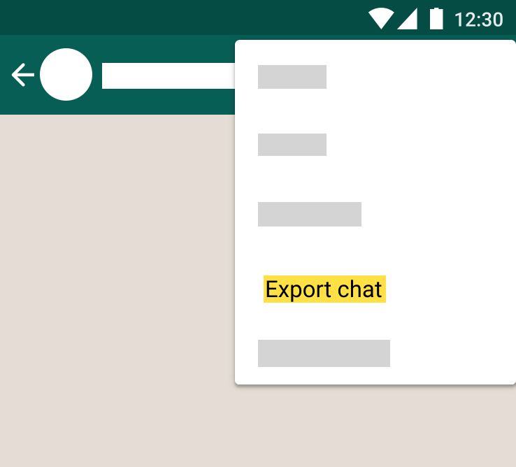
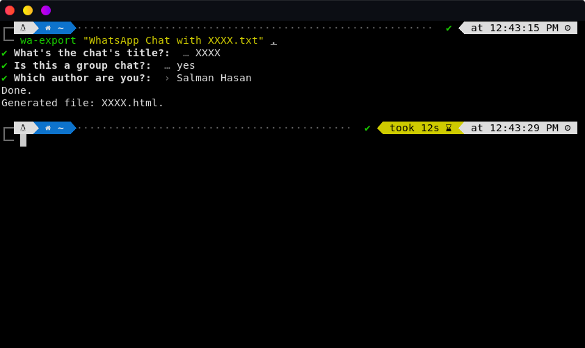
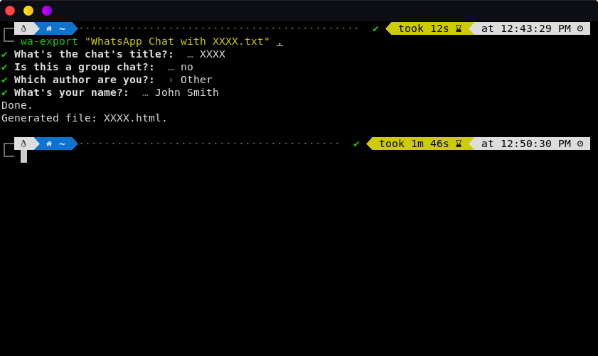
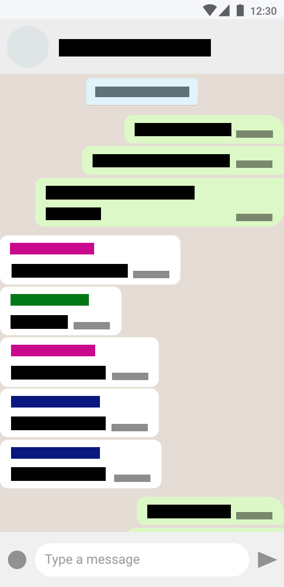

# wa-export

> A CLI Tool That Turns Whatsapp Chat Exports to Visual Webpage

## Install

Using npm: 
```console
$ npm install -g wa-export
```

Using yarn:
```console
$ yarn global add wa-export
```

## Usage

### Step 1: Export chat from Whatsapp App

<br>

<br>

You'll get a  text file called "WhatsApp Chat with XXXX.txt"

### Step 2: Use wa-export

```console
$ wa-export path/to/file/"WhatsApp Chat with XXXX.txt" path/to/output/directory/
```

### Step 3: Answer each prompt

<br>

<br>

And you are done! You have generated the chat's html file.

#### Note:

<p>If your name or number isn't part of the list<br>you may select the option "Other" to manually type your name</p>

<br>

<br>

### Step 4: View the html file

<p>The html file can be opened in a browser for view.<br>
(although a http server is recommended)</p>

<br>

<br>

## Uninstall

Using npm: 
```console
$ npm remove -g wa-export
```

Using yarn:
```console
$ yarn global remove wa-export
```
